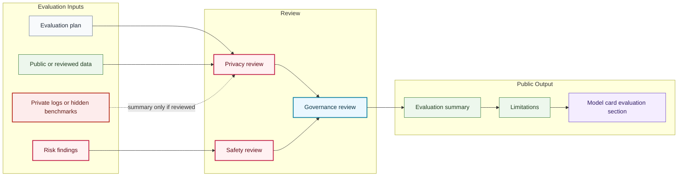

# Evaluation Flow

## Purpose

This graph shows how evaluation material is converted into a public-safe evaluation summary.

## Mermaid Diagram

## Interpretation Notes

- Public evaluation summaries are reviewed summaries, not private evaluation dumps.
- Hidden benchmarks and private logs remain blocked unless a public-safe summary is approved.
- Limitations are part of the evaluation output.

## Boundary Notes

- Do not expose private prompts, telemetry, donor data, student data, customer data, or sensitive failure logs.
- Evaluation evidence must be public or explicitly reviewed for public summary.
- Metrics without public context must not be used as portfolio claims.

## Follow-Up Actions

- Define evaluation evidence links when real releases exist.
- Add model-specific evaluation summaries after review.
- Revisit the graph if evaluation categories change.
