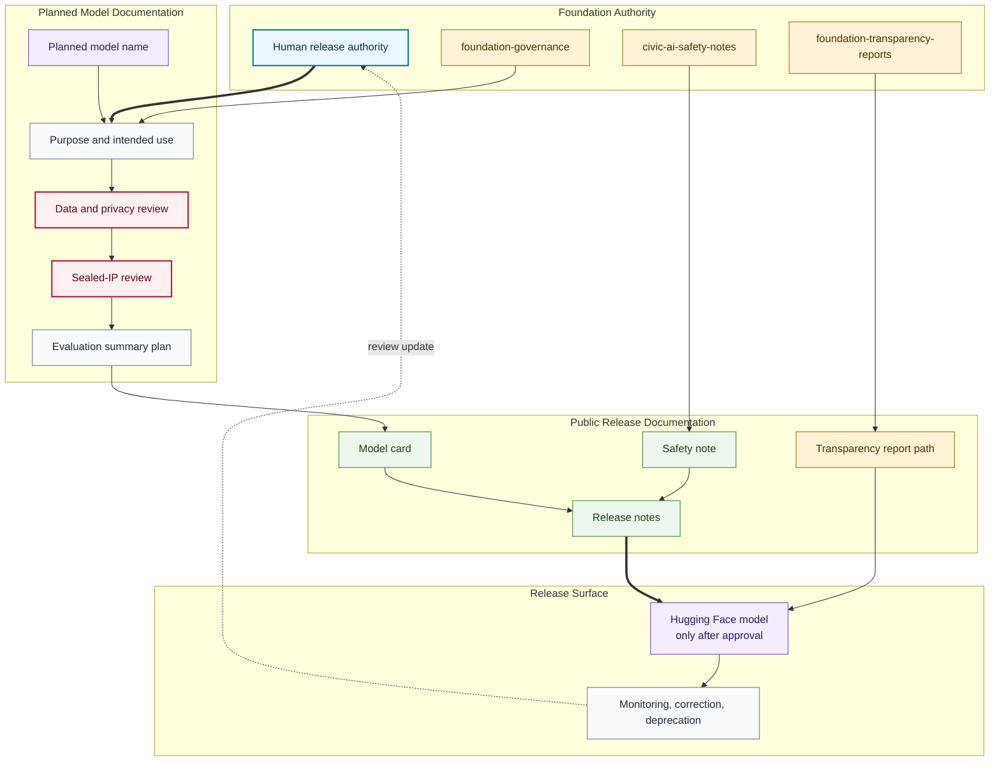

# Model Card Release Flow

## Purpose

This graph shows how a planned model moves through scope, review, model card documentation, safety notes, release notes, Hugging Face release, and monitoring.

## Mermaid Diagram

## Interpretation Notes

- Planned model names do not imply model artifacts exist.
- Model cards are release prerequisites, not post-release decoration.
- Hugging Face release is downstream from governance, safety, privacy, sealed-IP, and documentation review.

## Boundary Notes

- Private training corpora, sealed scripts, private evaluations, hidden benchmarks, and unreleased weights stay outside public docs.
- Safety notes and transparency paths are required before public reliance is invited.
- Monitoring can trigger correction, pause, or deprecation.

## Follow-Up Actions

- Add model-specific cards only after human review.
- Link Hugging Face model repositories only after they exist with approved cards.
- Update transparency reports after any release.
