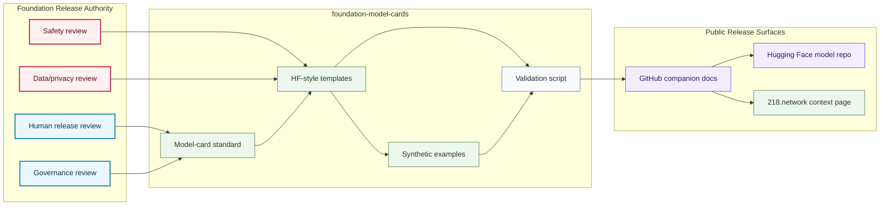

# Model Card System Map

## Purpose

This graph shows how model-card templates, standards, synthetic examples, validation, GitHub companions, and Hugging Face release surfaces relate.

## Mermaid Diagram

## Interpretation Notes

- GitHub standards and templates are public documentation infrastructure.
- Hugging Face is downstream from GitHub companion docs and human review.
- Synthetic examples do not imply a model exists.

## Boundary Notes

- Private corpora, weights, sealed scripts, private evaluations, hidden benchmarks, and prompts are excluded.
- Planned links stay placeholders until public artifacts exist.
- `218.network` context pages require separate public review.

## Follow-Up Actions

- Add model-specific cards only after release review.
- Link public Hugging Face repositories only after they exist.
- Update this map when release gates change.
