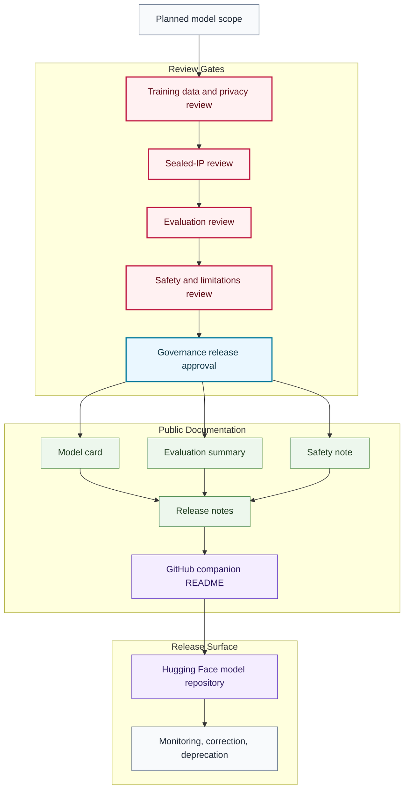

# Model Release Flow

## Purpose

This graph shows the release-documentation flow from planned model scope to reviewed public Hugging Face model release.

## Mermaid Diagram

## Interpretation Notes

- Planned model scope is not a release claim.
- Model cards and release notes are prerequisites for public release.
- Monitoring can trigger correction, pause, deprecation, or removal.

## Boundary Notes

- Weights, private corpora, sealed scripts, production prompts, and private evaluations do not enter public documentation.
- Evaluation summaries must not expose hidden benchmarks or private logs.
- Hugging Face links appear only after release approval.

## Follow-Up Actions

- Add release approval records outside this public repo when sensitive.
- Create model-specific companion docs only after review.
- Update status tables when a model changes state.
