# Public Private Boundary Map

## Purpose

This graph separates public model-card material from private, sealed, and blocked model-development material.

## Mermaid Diagram

```mermaid
flowchart LR
  subgraph public["Allowed Public Documentation"]
    templates["Model-card templates"]:::public
    synthetic["Synthetic examples"]:::public
    status["Status language"]:::public
    summaries["Reviewed summaries"]:::public
    notes["Safety and release notes"]:::public
  end

  subgraph blocked["Blocked Material"]
    weights["Weights and checkpoints"]:::sealed
    corpora["Private training corpora"]:::sealed
    scripts["Sealed scripts"]:::sealed
    evals["Private evaluations"]:::sealed
    prompts["Production prompts"]:::sealed
    telemetry["Private telemetry"]:::sealed
    pii["Donor, student, volunteer, customer data"]:::sealed
  end

  subgraph gate["Release Gate"]
    privacy["Privacy review"]:::risk
    safety["Safety review"]:::risk
    sealedReview["Sealed-IP review"]:::risk
    approve["Human approval"]:::authority
  end

  public --> privacy
  blocked -. excluded or summary only .-> privacy
  privacy --> safety
  safety --> sealedReview
  sealedReview --> approve

  classDef authority fill:#eaf7ff,stroke:#027a9d,stroke-width:2px,color:#083344;
  classDef public fill:#edf7ed,stroke:#3a7d3a,color:#1f3d1f;
  classDef sealed fill:#fdecec,stroke:#b42318,stroke-width:2px,color:#5f1711;
  classDef risk fill:#fff1f2,stroke:#be123c,stroke-width:2px,color:#5f0715;
```

## Interpretation Notes

- Public templates can describe required fields without exposing private development material.
- Blocked material may not be published as examples, screenshots, logs, summaries, or generated outputs without review.
- Human approval remains required before release.

## Boundary Notes

- No weights, private corpora, sealed scripts, hidden benchmarks, private prompts, or private telemetry are stored here.
- Sensitive NEURONA operational details and exact sensitive infrastructure locations are excluded.
- Planned model names remain non-release references.

## Follow-Up Actions

- Keep model-specific exclusions in every reviewed card.
- Expand blocked categories if new sensitive artifact types appear.
- Align Hugging Face releases to this boundary.
