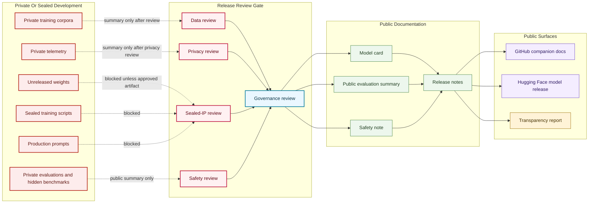

# Sealed To Release Boundary Map

## Purpose

This graph separates sealed or private model development material from public model-card and Hugging Face release documentation.

## Mermaid Diagram

## Interpretation Notes

- Public model-card documentation can summarize approved categories and limits, but not publish sealed development material.
- Hugging Face release is downstream from public release notes and governance review.
- Public evaluation summaries are summaries, not private evaluation dumps.

## Boundary Notes

- Sealed scripts, production prompts, private corpora, private evaluations, and private telemetry are blocked from public docs by default.
- Unreleased weights cannot appear in public GitHub or Hugging Face releases without explicit artifact release authorization.
- Public summaries must be reviewed for method leakage.

## Follow-Up Actions

- Add release approval records before first model release.
- Define model-specific exclusions in each reviewed model card.
- Revisit this map if any model moves to experimental status.
